<h1 align="center">PROJECTE ASIX-MP14 GRUP 4</h1>

Projecte realitzat per Arnau Serra, Svyatoslav Leshchuck i Lluc López.

## Índex

1. **Fase de reconeixement**  
   1.1 [Shodan API](#shodan-api)  
   1.2 [The Harvester](#the-harvester)  
   1.3 [OSINT](#osint)  

2. **Auditoria de serveis**  
   2.1 [Nmap](#nmap)  
   2.2 [SSH-Audit](#ssh-audit)  
   2.3 [Enum4linux](#enum4linux)  

3. **Funcionalitats afegides**  
   3.1 [Telegram Bot](#telegram-bot)  
   3.2 [Docker Container](#docker-container)  

## Introducció

Aquest projecte inclou una eina principal per a l'automatització d'auditories, desenvolupada en Python 3 i desplegable amb Docker. Està disponible tant en mode gràfic com en consola per oferir més comoditat a l'usuari.

Aqui podem observar l'aspecte de l'aplicació amb interfície gràfica:

 

Observem apartat per apartat el codi que hem fet servir per aconseguir aquest resultat...
 
## Fase de reconeixement
### Shodan API
En aquesta secció es descriu com interactuar amb l'**API de Shodan** per obtenir informació sobre dispositius i serveis exposats a Internet.

#### Funcions Shodan API
- `obrir_shodan`: Aquesta funció obre una nova finestra en la GUI on l'usuari pot introduir una adreça IP o un domini per cercar dispositius exposats utilitzant Shodan API.

- **Descripció**:
  - La finestra permet a l'usuari introduir una IP o domini per fer cerques en la base de dades de Shodan.
  - L'usuari pot veure el resultat de la cerca, incloent dispositius exposats i els serveis associats amb cada IP o domini.
  - S'utilitza la clau API de Shodan per accedir a la base de dades.

- **Paràmetres**:
  - `self.shodan_api_key`: Clau API de Shodan necessària per realitzar les cerques.
  - `self.shodan_ip_entry`: Camp d'entrada de la IP o domini a buscar.

- **Sortida**:
  - Mostra els resultats de la cerca de dispositius exposats i serveis associats en la finestra de resultats de l'aplicació.

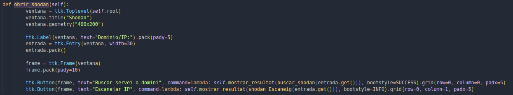
 

---

 

- `buscar_shodan`: Aquesta funció realitza la cerca utilitzant la API de Shodan per obtenir informació sobre una IP o domini.

- **Descripció**:
  Aquesta funció realitza una cerca en Shodan per un domini donat, utilitzant la URL de cerca de Shodan per fer-ho.

- **Paràmetres**:
  - `dominio`: El domini o adreça de cerca a Shodan.

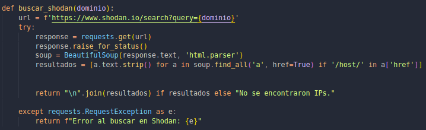

---

 

- `shodan_Escaneig`: Aquesta funció executa la cerca a Shodan API i mostra els resultats obtinguts.

- **Descripció**:
  Realitza una cerca a través de l'API de Shodan per obtenir informació sobre una IP específica, incloent l'organització i els ports oberts. Després, executa un escaneig Nmap per obtenir més informació sobre els serveis i versions dels ports oberts.

- **Paràmetres**:
  - `ip`: L'adreça IP que es vol escanejar.

- **Sortida**:
  - Retorna una cadena de text amb la informació obtinguda de Shodan (organització, ports oberts) i el resultat de l'escaneig Nmap.

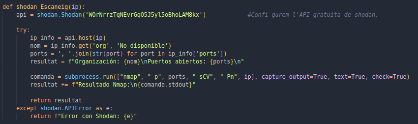

---

### The Harvester
### Funcions: 

- `obrir_theHarvester`

- **Descripció**:
  Aquesta funció obre una finestra per a la interacció amb l'eina `TheHarvester`. Permet a l'usuari introduir el nom d'un domini i seleccionar un motor de cerca per a realitzar cerques d'informació (subdominis, correus electrònics, etc.). Quan l'usuari clica el botó "Executar TheHarvester", es crida la funció `executar_theHarvester`.

- **Paràmetres**:
  - No rep paràmetres directament, però interactua amb els següents elements de la interfície gràfica:
    - `self.nom_domini`: Campo d'entrada per al domini a cercar.
    - `self.combo_busqueda`: Combinació desplegable per seleccionar el motor de cerca (Google, Bing, Yahoo, etc.).

- **Sortida**:
  - Mostra una nova finestra on l'usuari pot introduir el domini i seleccionar el motor de cerca.
  - Després d'introduir la informació, permet executar la cerca amb `TheHarvester` i mostra els resultats a la interfície gràfica.

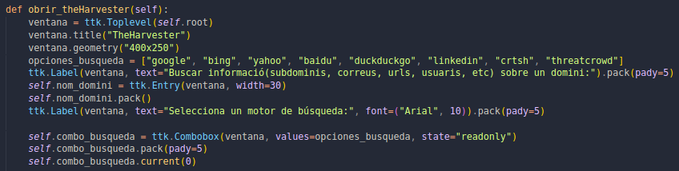

---
 

- `executar_theHarvester`

- **Descripció**:
  Aquesta funció s'executa quan l'usuari clica el botó "Executar TheHarvester" a la finestra. Utilitza l'eina `TheHarvester` per cercar informació sobre un domini (com subdominis, correus electrònics, URLs, usuaris, etc.) a partir d'un motor de cerca seleccionat per l'usuari.

- **Paràmetres**:
  - `self.nom_domini.get()`: Obté el nom del domini que l'usuari introdueix a la interfície gràfica.
  - `self.combo_busqueda.get()`: Obté el motor de cerca seleccionat per l'usuari (com Google, Bing, Yahoo, etc.).

- **Sortida**:
  - Mostra els resultats de la cerca d'informació sobre el domini a la finestra de resultats.
  - Si hi ha errors durant l'execució, es mostra un missatge d'error.

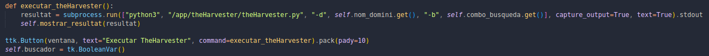

---

### OSINT

A continuació es descriuen les eines OSINT disponibles al projecte mitjançant la funció `obrir_osint`, amb més detall sobre les seves característiques, paràmetres i sortida.

#### 1. **ExifTool**
- **Descripció**: 
  ExifTool és una eina per extreure metadades d'arxius. Permet obtenir informació com la data de creació, la ubicació (si està disponible), el dispositiu amb què es va crear el fitxer, i més. Funciona amb una gran varietat de formats de fitxers, incloent imatges, documents, vídeos i altres arxius.
  
- **Paràmetres**: 
  - Arxiu d'entrada: Fitxer o conjunt de fitxers del qual es vol obtenir la metadada.
  
- **Sortida**: 
  - Mostra un conjunt de metadades sobre el fitxer, com el creador, la data de creació, la ubicació, entre altres.
  
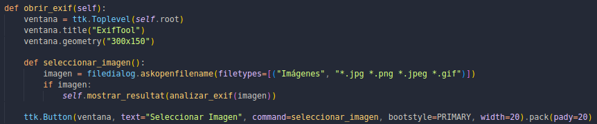

  
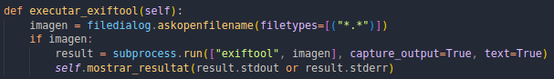
 
 

---

#### 2. **Sherlock**
- **Descripció**:
  Sherlock és una eina dissenyada per cercar noms d'usuari en múltiples plataformes socials i serveis web, com Facebook, Twitter, Instagram, GitHub, entre altres. Permet comprovar si un nom d'usuari està registrat a una gran varietat de llocs web.

- **Paràmetres**:
  - `nom_usuari`: Nom d'usuari que es vol cercar a través de múltiples plataformes.

- **Sortida**:
  - Llista de URLs on el nom d'usuari es troba disponible o en ús en diferents plataformes.
  
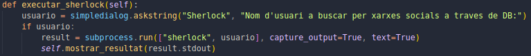
 

---

#### 3. **Sublist3r**
- **Descripció**:
  Sublist3r és una eina per a la descoberta de subdominis a partir d'un domini. Utilitza diverses fonts de cerca com cercadors públics (Google, Bing, etc.) per obtenir informació sobre subdominis associats amb el domini proporcionat.

- **Paràmetres**:
  - `domini`: El domini al qual es vol descobrir subdominis associats.

- **Sortida**:
  - Llista de subdominis trobats per al domini proporcionat.
  
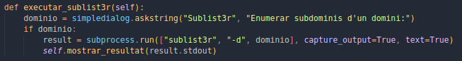
 

---

#### 4. **Instaloader**
- **Descripció**:
  Instaloader és una eina que permet descarregar informació pública d'Instagram. Pot descarregar imatges, perfils complets, stories i altres dades relacionades amb un compte d'Instagram.

- **Paràmetres**:
  - `usuari`: Nom d'usuari d'Instagram que es vol descarregar.
  
- **Sortida**:
  - Arxius amb la informació pública de l'usuari, incloent fotos, vídeos, perfil, etc.
  
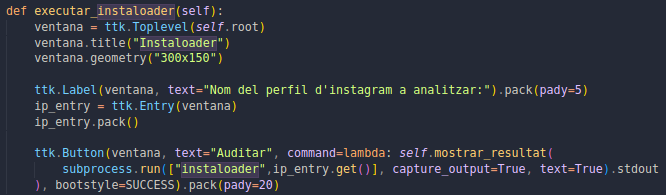
 
  
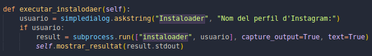
 

---

#### 5. **Holehe**
- **Descripció**:
  Holehe és una eina per obtenir informació relacionada amb una adreça de correu electrònic. Permet descobrir comptes socials i altres serveis online associats al correu proporcionat.

- **Paràmetres**:
  - `correu`: Adreça de correu electrònic que es vol investigar.
  
- **Sortida**:
  - Llista de comptes socials i altres serveis associats a l'adreça de correu electrònic proporcionada.
  
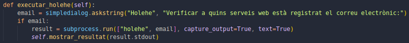
 

---

#### 6. **Dnsrecon**
- **Descripció**:
  Dnsrecon és una eina d'OSINT per auditar el DNS d'un domini. Permet obtenir informació sobre servidors de noms, subdominis, registres de DNS i més. Aquesta eina és útil per identificar vulnerabilitats en la configuració de DNS d'un domini.

- **Paràmetres**:
  - `domini`: El domini per al qual es vol realitzar l'auditoria de DNS.

- **Sortida**:
  - Llista de subdominis, servidors de noms i altres informació de configuració DNS relacionada amb el domini.
  
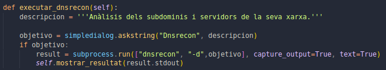
 

---

#### 7. **Whois**
- **Descripció**:
  WhoIs és una eina per obtenir informació de registre sobre un domini, com ara el propietari, les dates de creació i caducitat, els servidors DNS, entre altres dades associades al domini.

- **Paràmetres**:
  - `domini`: El domini per al qual es vol obtenir la informació WhoIs.
  
- **Sortida**:
  - Informació sobre el registre del domini, incloent el propietari, les dates de creació i caducitat, servidors DNS, etc.
  

 

---

#### 8. **Photon**
- **Descripció**:
  Photon és una eina per extreure URLs, correus electrònics, fitxers i metadades relacionades amb un domini web. Analitza pàgines web per identificar informació útil per a la recerca OSINT.

- **Paràmetres**:
  - `domini`: El domini per al qual es vol obtenir informació.
  
- **Sortida**:
  - Llista de URLs, correus electrònics i altres metadades trobades en el domini especificat.
  
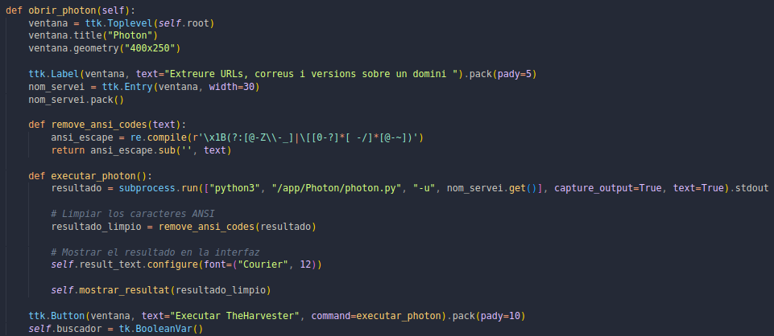
 

---

#### 9. **GeoIP**
- **Descripció**:
  GeoIP és una eina que permet obtenir la geolocalització aproximada d'una adreça IP. Aquesta eina pot determinar la ubicació física de l'IP, com el país, ciutat i altres dades geogràfiques associades.

- **Paràmetres**:
  - `ip`: L'adreça IP de la qual es vol obtenir la geolocalització.

- **Sortida**:
  - Informació sobre la ubicació geogràfica de l'adreça IP, com el país, ciutat, etc.

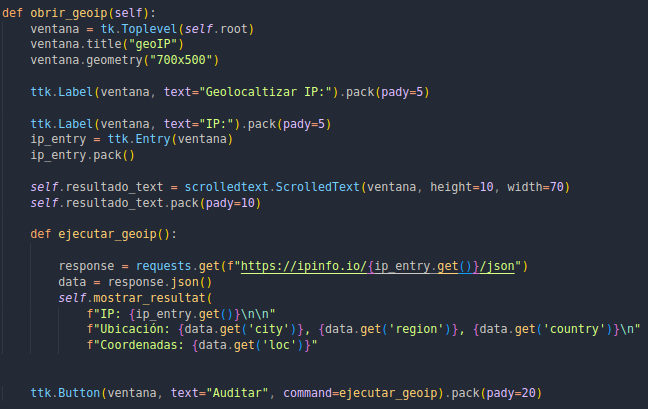

## Auditoria de serveis
### Nmap
En aquesta secció es descriuen les funcions que interactuen amb **Nmap** per realitzar diferents tipus d'escaneigs de xarxes i vulnerabilitats.

#### Funcions Nmap
- `obrir_nmap`: Aquesta funció obre una nova finestra a la interfície gràfica d'usuari (GUI) que permet a l'usuari configurar i executar diferents tipus d'escaneigs Nmap.

- **Descripció**:
  - La finestra mostra camps per introduir una adreça IP o seleccionar una interfície de xarxa.
  - L'usuari pot triar entre diverses opcions avançades, com la detecció del sistema operatiu, versió dels serveis o mode agressiu.
  - L'usuari pot executar:
    - **Escaneig de hosts**: Realitza un escaneig bàsic dels hosts actius.
    - **Escaneig complet**: Realitza un escaneig complet dels ports en el host.
    - **Detecció de vulnerabilitats**: Escaneja ports i serveis a la recerca de vulnerabilitats.

- **Paràmetres**:
  - `self.nmap_ip_entry`: Camp d'entrada de IP o rang.
  - `self.interface_var`: Camp de selecció d'interfície de xarxa.
  - `self.nmap_os_detection`, `self.nmap_service_version`, `self.nmap_aggressive`: Opcions avançades com la detecció del sistema operatiu, la detecció de versió dels serveis i el mode agressiu de Nmap.

- **Sortida**:
  - Mostra els resultats de l'escaneig a la finestra de resultats de l'aplicació.

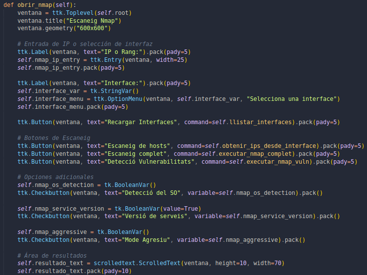

---
 

- `llistar_interfaces`: Funció que obté i llista les interfícies de xarxa disponibles al sistema operatiu.

- **Descripció**:
  - Obté la llista d'interfícies de xarxa disponibles al sistema operatiu (Windows o Linux).
  - En el cas de Windows, utilitza el comandament `ipconfig` per obtenir la informació de les interfícies.
  - En el cas de Linux, utilitza el comandament `ifconfig -a`.

- **Sortida**:
  - Mostra les interfícies disponibles a un menú desplegable per poder seleccionar la interfície que es vol utilitzar.

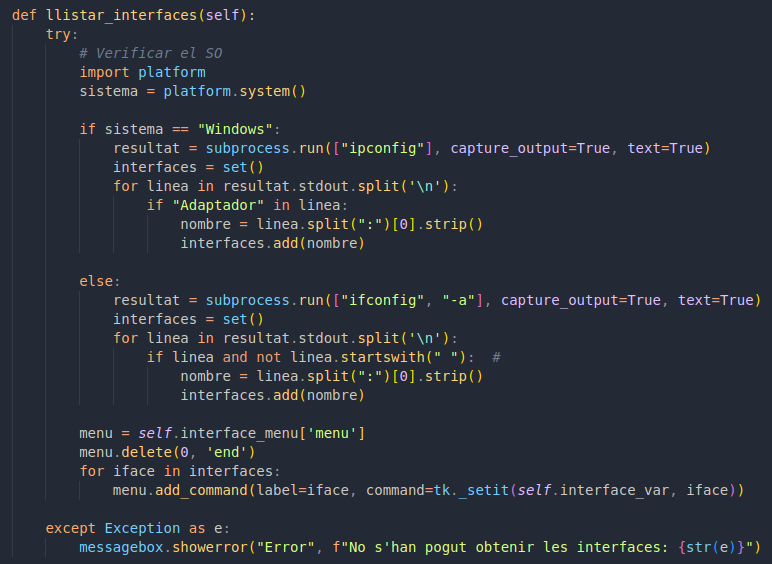

---
 

- `obtenir_ips_desde_interface`: Aquesta funció obté les adreces IP associades a una interfície de xarxa seleccionada.

- **Descripció**:
  - Aquesta funció consulta la interfície seleccionada per obtenir les IPs associades.
  - Utilitza el comandament `ip addr show` per obtenir les IPs de la interfície seleccionada.

- **Paràmetres**:
  - `interfaz`: Nom de la interfície seleccionada.

- **Sortida**:
  - Retorna una llista d'IPs associades a la interfície seleccionada.

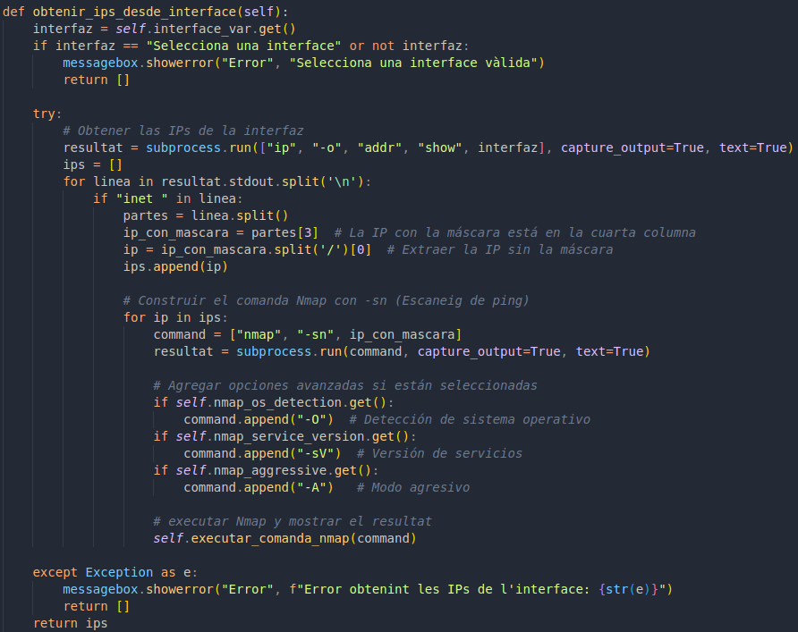

---
 

- `executar_nmap_complet`: Aquesta funció executa un escaneig complet de ports mitjançant Nmap en les IPs seleccionades o introduïdes manualment.

- **Descripció**:
  - Utilitza el comandament `nmap -p- --open` per escanejar tots els ports oberts d'una IP.
  - Permet habilitar opcions avançades com la detecció del sistema operatiu (`-O`), la versió de serveis (`-sV`), i el mode agressiu (`-A`).

- **Paràmetres**:
  - `self.nmap_ip_entry`: Camp d'entrada de IP o rang.
  - `self.interface_var`: Camp de selecció d'interfície de xarxa.
  - `self.nmap_os_detection`, `self.nmap_service_version`, `self.nmap_aggressive`: Opcions per configurar el tipus d'escaneig.

- **Sortida**:
  - Mostra els resultats de l'escaneig a la finestra de resultats de l'aplicació.

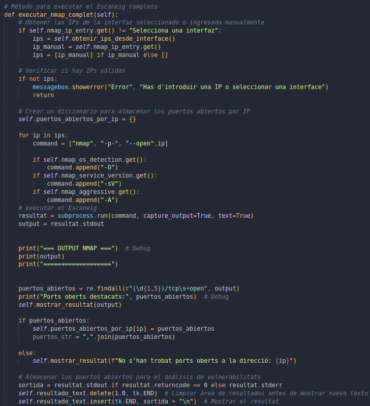

---
 

- `executar_nmap_vuln`: Funció que realitza un escaneig de vulnerabilitats en els ports oberts obtinguts en un escaneig previ de Nmap.

- **Descripció**:
  - Realitza una anàlisi de vulnerabilitats mitjançant Nmap, utilitzant el script `--script vuln` per identificar possibles vulnerabilitats en els serveis actius.
  - La funció recorre les IPs i els ports oberts per realitzar el diagnòstic de vulnerabilitats.

- **Paràmetres**:
  - `self.puertos_abiertos_por_ip`: Diccionari amb les IPs i els ports oberts per cada IP.

- **Sortida**:
  - Mostra les vulnerabilitats detectades per cada IP en la finestra de resultats de l'aplicació.

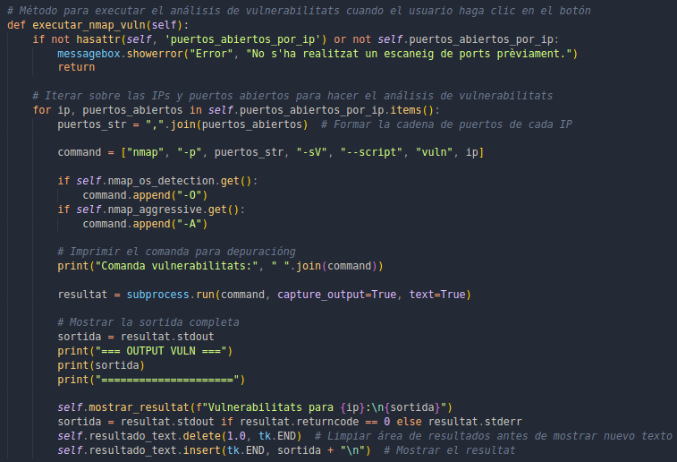

---
 

- `executar_comanda_nmap`: Executa una comanda Nmap personalitzada i mostra els resultats.

- **Descripció**:
  - Aquesta funció permet executar qualsevol comanda Nmap proporcionada per l'usuari o el sistema i mostrar els resultats a la finestra de resultats.
  
- **Paràmetres**:
  - `command`: Comanda Nmap per executar.

- **Sortida**:
  - Mostra els resultats de l'escaneig a la finestra de resultats de l'aplicació.

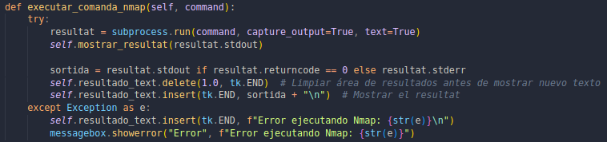

---

### SSH-Audit
#### Funció: `obrir_ssh`

- **Descripció**:
  Aquesta funció obre una nova finestra en la interfície gràfica per permetre a l'usuari introduir una IP i un port per auditar el servei SSH a través de l'eina `ssh-audit`. Mostra els resultats de l'auditoria a la finestra de resultats de l'aplicació.

- **Paràmetres**:
  - No requereix paràmetres directes, ja que utilitza l'entrada de l'usuari des de la interfície gràfica.
  
- **Sortida**:
  - Mostra els resultats de l'auditoria SSH a la finestra de resultats de l'aplicació. Si hi ha un error en l'execució, es mostra un missatge d'error.

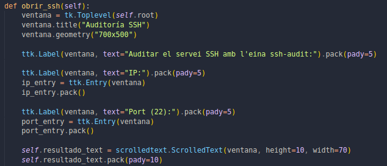

---

### Enum4linux
#### Funcions enum4linux: 
- `obrir_enum4linux`

- **Descripció**:
  Aquesta funció obre una finestra en la interfície gràfica que permet a l'usuari introduir una adreça IP per realitzar una auditoria SMB mitjançant l'eina `enum4linux`. Els resultats de l'auditoria es mostren a la finestra de resultats.

- **Paràmetres**:
  - No requereix paràmetres directes, ja que utilitza l'entrada de l'usuari des de la interfície gràfica.

- **Sortida**:
  - Mostra els resultats de l'auditoria SMB obtinguts amb `enum4linux` a la finestra de resultats de l'aplicació.
  - Si hi ha un error en l'execució, es mostra un missatge d'error a la finestra de resultats.

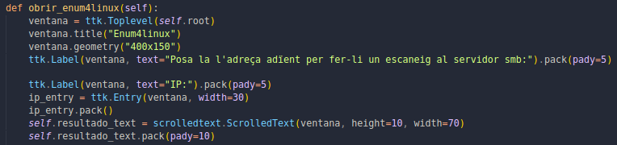

---
 

- `executar_enum4linux`

- **Descripció**:
  Aquesta funció s'executa quan l'usuari clica el botó "Executar Enum4linux" a la finestra. Utilitza l'eina `enum4linux` per obtenir informació detallada sobre un servidor SMB (adreça IP proporcionada per l'usuari) i mostra els resultats a la interfície gràfica.

- **Paràmetres**:
  - `ip_entry.get()`: Obté la IP que l'usuari introdueix a la interfície gràfica.

- **Sortida**:
  - Mostra els resultats de l'auditoria SMB obtinguts mitjançant `enum4linux` a la finestra de resultats.
  - Si hi ha errors durant l'execució, es mostra un missatge d'error.

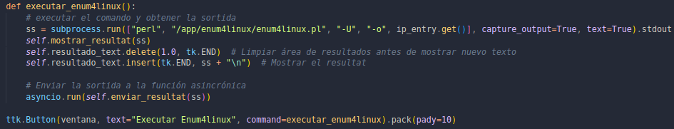

---
 
## Funcionalitats afegides
### Telegram Bot

Aquest fragment de codi configura i utilitza un **Telegram Bot** per enviar missatges als usuaris i gestionar les comunicacions en temps real.

#### 1. Funció: send_message
- **Descripció**:
Aquesta funció s'encarrega d'enviar missatges al xat de Telegram especificat mitjançant l'API de Telegram. Utilitza l'objecte `bot` per enviar missatges al xat identificat per `chat_id`.

- **Paràmetres**:
  - `text`: El missatge que s'ha d'enviar.
  - `chat_id`: Identificador del xat de Telegram on s'ha d'enviar el missatge.

- **Sortida**:
  - El missatge és enviat al xat de Telegram i es registra un missatge d'informació o error segons el resultat de l'enviament.

#### 2. Funció: send_large_message
- **Descripció**:
Aquesta funció gestiona l'enviament de missatges més grans (de més de 4096 caràcters), dividint-los en parts i enviant-les una per una. Això és necessari perquè Telegram té una limitació de 4096 caràcters per missatge.

- **Paràmetres**:
  - `text`: El missatge que es vol enviar, que pot ser de més de 4096 caràcters.
  - `chat_id`: Identificador del xat de Telegram on s'ha d'enviar el missatge.

- **Sortida**:
  - El missatge s'envia en parts de màxim 4096 caràcters i s'espera un temps de 3 segons entre cada enviament per evitar sobrecarregar el servidor de Telegram.

#### 3. Funció: Configuració de l'API de Telegram
- **Descripció**:
Es configura el bot de Telegram mitjançant l'ús de la llibreria `telegram.ext` i la configuració d'una aplicació amb un token d'autenticació. També es crea un nou fil d'esdeveniments per gestionar la comunicació asíncrona.

- **Paràmetres**:
  - `TOKEN`: El token d'autenticació obtingut de Telegram per a identificar el bot.
  - `chat_id`: El identificador únic del xat al qual el bot enviará els missatges.

- **Sortida**:
  - S'inicia el bot i es prepara per enviar missatges i gestionar les comandes a través de Telegram.

#### 4. Funció: send_message
- **Descripció**:
Funció que envia missatges de forma asíncrona mitjançant el bot de Telegram. Això permet que el bot no es bloquegi mentre espera per l'enviament dels missatges.

- **Paràmetres**:
  - `text`: Missatge a enviar.
  - `chat_id`: Identificador del xat de Telegram.

- **Sortida**:
  - El missatge és enviat al xat indicat i es registren els resultats d'aquesta acció (informació o error).

#### 5. Funció: send_large_message
- **Descripció**:
Gestiona l'enviament de missatges grans (més de 4096 caràcters) dividint-los en parts petites i enviant-les una per una. Té en compte el límit de caràcters de Telegram per missatge.

- **Paràmetres**:
  - `text`: El missatge llarg a enviar.
  - `chat_id`: Identificador del xat de Telegram.

- **Sortida**:
  - El missatge es divideix i s'envia en parts més petites amb un petit interval de temps entre cada enviament per evitar sobrecarregar el servidor.

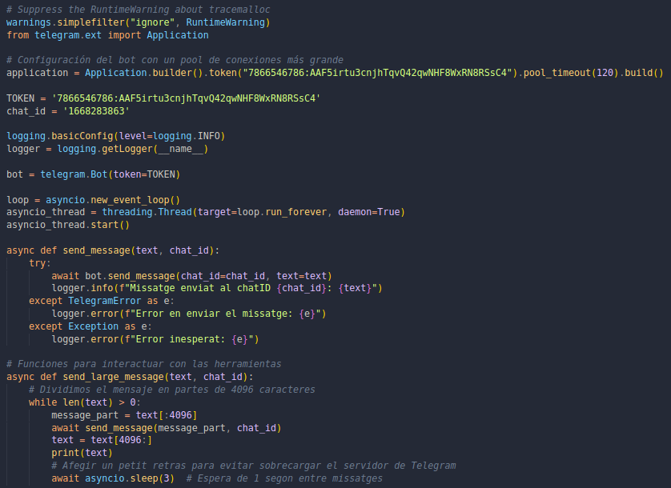
 

**Exemple visual del missatge enviat de part d'NMAP:**

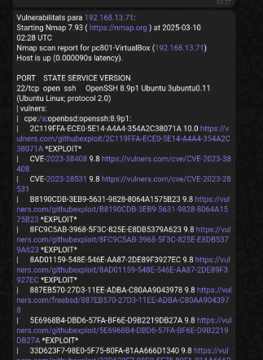
 

### Docker Container

#### Runtool.sh

El script `RunTool.sh` és un script en Bash que facilita la creació de la imatge Docker i l'execució del contenidor amb les configuracions adequades per a l'entorn gràfic i de xarxa.

- **Descripció**:
Aquest script realitza diverses tasques per configurar i executar el contenidor Docker de manera eficaç. Inclou la comprovació si **Docker** està instal·lat, la configuració de les variables d'entorn per a **X11** (necessàries per a la interfície gràfica), i l'execució del contenidor amb permisos de xarxa i accés gràfic.

 **Passos clau**:
1. **Verificació de Docker:**
   - El script comprova si **Docker** està instal·lat al sistema. Si no ho està, es mostra un missatge d'error i s'atura l'execució.
   
2. **Comprovació de les variables d'entorn:**
   - El script comprova si les variables d'entorn **DISPLAY** i **XAUTHORITY** estan definides, ja que són essencials per executar aplicacions en mode gràfic a través de **X11**.
   
3. **Construcció de la imatge Docker:**
   - Si totes les condicions es compleixen, es construeix la imatge Docker utilitzant el `Dockerfile` amb la comanda `docker build`.

4. **Execució del contenidor Docker:**
   - El script llança el contenidor amb les opcions adequades per a l'accés a la xarxa, les variables d'entorn **DISPLAY** i **XAUTHORITY**, i els volums per a l'accés gràfic.
   - Finalment, executa l'aplicació Python (`script3.py`) dins del contenidor.

 

**Paràmetres**:
- **CONTAINER_NAME:** Nom del contenidor temporal creat pel script (`temp_projecte_container`).
- **IMAGE_NAME:** Nom de la imatge Docker (`projectemp14_app`).
- **Variables d'entorn:** `DISPLAY`, `XAUTHORITY` per a l'accés gràfic mitjançant **X11**.
  
**Sortida**:
- El contenidor Docker es crea i s'executa amb els permisos adequats. L'aplicació Python es llança dins del contenidor i es gestiona mitjançant la interfície gràfica.

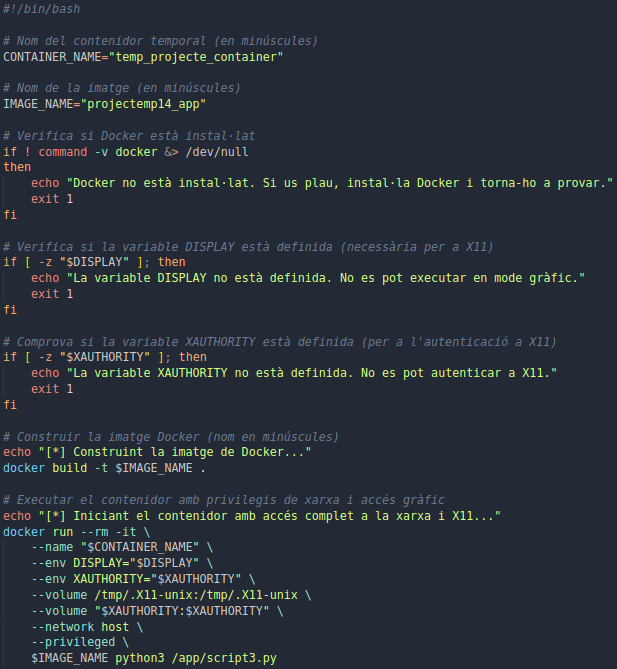
 
